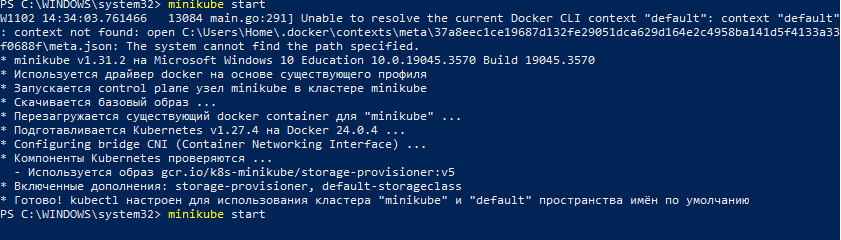
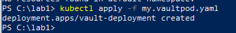
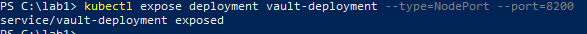
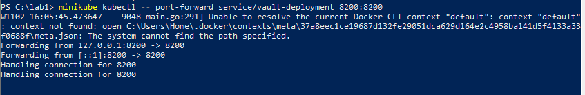
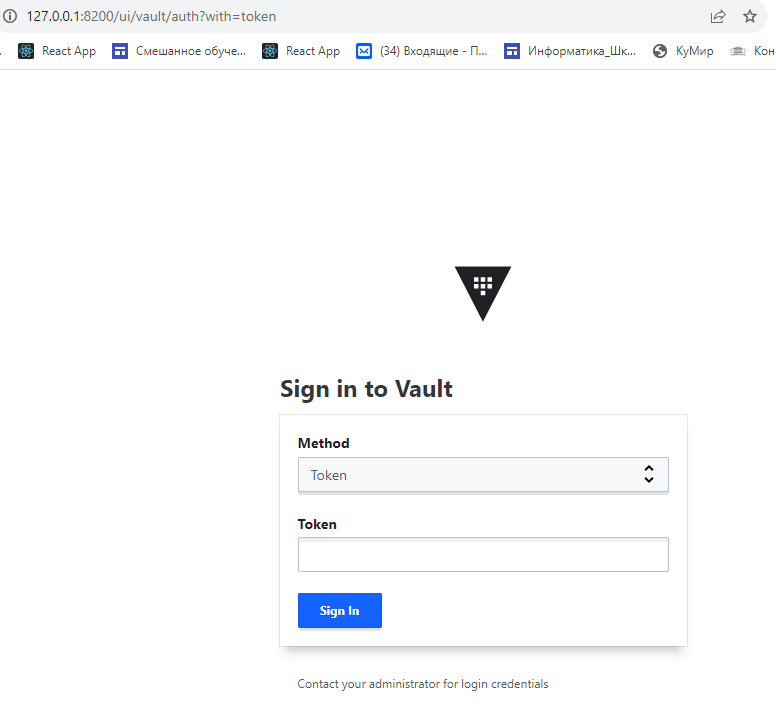
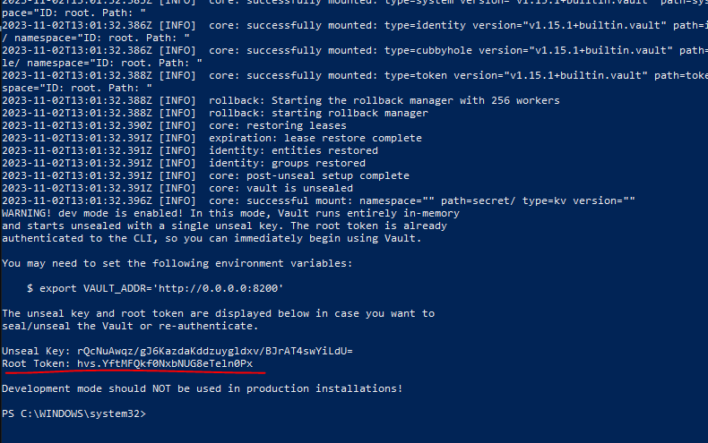
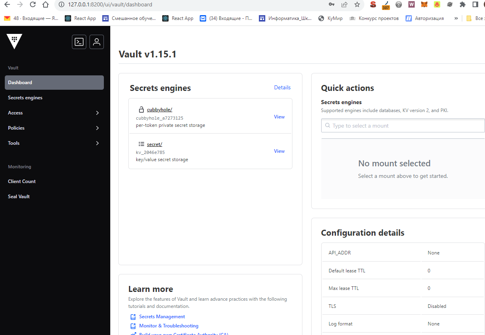
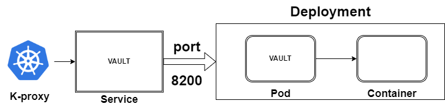

University: [ITMO University](https://itmo.ru/ru/) \
Faculty: [FICT](https://fict.itmo.ru) \
Course: [Introduction to distributed technologies](https://github.com/itmo-ict-faculty/introduction-to-distributed-technologies) \
Year: 2023/2024\
Group: K4112C\
Author: Kuznetsov Vyacheslav Sergeevich \
Lab: Lab1 \
Date of create: 02.11.2023 \
Date of finished:  02.11.2023 \

# Лабораторная работа №1 "Установка Docker и Minikube, мой первый манифест."
## Цель работы: Ознакомиться с инструментами Minikube и Docker, развернуть свой первый "под".

# Ход работы

## 1. Установка окружения:
Я установил Docker на свой компьютер, скачав установочный файл.
Установил WSL, так как разворачиваю кластер на машине с Windows 10.
```wsl --install```

После этого я скачал установщик minickube.
Установив minikube, я добавил его к окружению через PowerShell:
```
$oldPath = [Environment]::GetEnvironmentVariable('Path', [EnvironmentVariableTarget]::Machine)
if ($oldPath.Split(';') -inotcontains 'C:\minikube'){
  [Environment]::SetEnvironmentVariable('Path', $('{0};C:\minikube' -f $oldPath), [EnvironmentVariableTarget]::Machine)
}
```
Также мне потребовалось установить активный контекст Докера через команду:
```docker context use default```

## 2. Запуск minikube
```
minikube start
```

 

## 3. Создание Pod и Deployment 
Далее я создал .yaml файл для развертывания **deployment**, в качестве образа использовал **hashicorp/vault**, разворачиваем:
```kubectl apply -f my.vaultpod.yaml```

 

Для создания сервиса, использовал команду
```
minikube kubectl -- expose pod vault --type=NodePort --port=8200
```

 

Перенаправляем порты для доступа к контейнеру сервиса:
```
minikube kubectl -- port-forward service/vault-deployment 8200:8200
```


Запускаем сервис в браузере:



# 4. Получение токена:
Чтобы получить токен для доступа к сервису, смотрим логи **pod'а***
``` kubectl logs vault-deployment-b467d4858-gfs8q```



Вводим **токен** и получаем доступ к контейнеру



## 5. Схема организации контейеров и сервисов:




