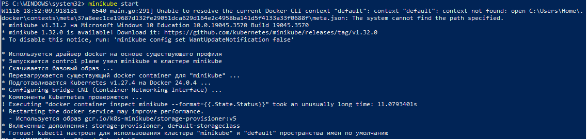
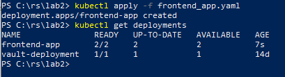
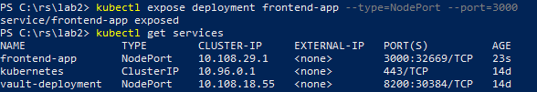
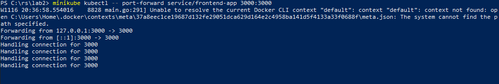
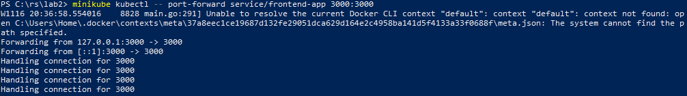
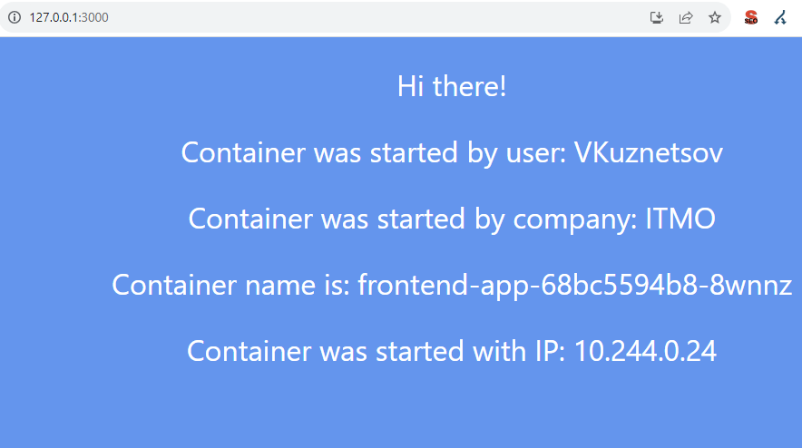
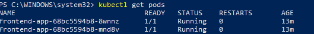
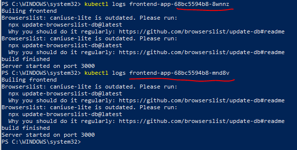
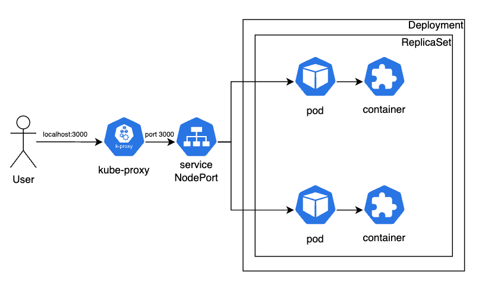

University: [ITMO University](https://itmo.ru/ru/) \
Faculty: [FICT](https://fict.itmo.ru) \
Course: [Introduction to distributed technologies](https://github.com/itmo-ict-faculty/introduction-to-distributed-technologies) \
Year: 2023/2024\
Group: K4112C\
Author: Kuznetsov Vyacheslav Sergeevich \
Lab: Lab2 \
Date of create: 16.11.2023 \
Date of finished:   \

# Лабораторная работа №2 "Развертывание веб сервиса в Minikube, доступ к веб интерфейсу сервиса. Мониторинг сервиса."

# Ход работы

## 1. Cоздание манифеста:
Для развертывания `Deployment` я создал манифест, в котором согласно заданию указал 
2 реплики `pod`, также добавил раздел `env`, в котором указал переменные окружения: 
`REACT_APP_USERNAME, REACT_APP_COMPANY_NAME`.

## 2. Запуск minikube
```
minikube start
```

 

## 3. Разворачиваем  Deployment 
В качестве образа использовал **ifilyaninitmo/itdt-contained-frontend:master**, разворачиваем:
```kubectl apply -f frontend-app.yaml```

 

Для создания сервиса, использовал команду
```
 minikube kubectl -- expose deployment frontend-app --type=NodePort --port=3000
```

 

Перенаправляем порты для доступа к контейнеру сервиса:
```
minikube kubectl -- port-forward service/frontend-app 3000:3000
```


Запускаем сервис в браузере:





# 4. Проверка **pod'ов**:
Проверим работают ли поды



# 5. ВЫВОД:
Переменные не изменяются, так как они создавались при создании подов и не переопределяются. 
Имя контейнера может меняться, так как у нас запущено два **pod'a** - в браузере мы видим имя одной из реплик.

# 6. СМОТРИМ ЛОГИ:


Они идентичны!

## 5. Схема организации контейеров и сервисов:




