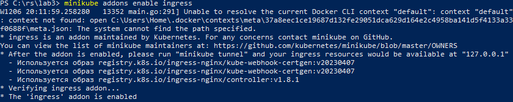

University: [ITMO University](https://itmo.ru/ru/) \
Faculty: [FICT](https://fict.itmo.ru) \
Course: [Introduction to distributed technologies](https://github.com/itmo-ict-faculty/introduction-to-distributed-technologies) \
Year: 2023/2024\
Group: K4112C\
Author: Kuznetsov Vyacheslav Sergeevich \
Lab: Lab2 \
Date of create: 06.12.2023 \
Date of finished:   \

# Лабораторная работа №3 "Сертификаты и "секреты" в Minikube, безопасное хранение данных."

# Ход работы

## 1. Cоздание манифеста для Config Map:
Создаем ConfigMap декаларативным способом через создание манифеста, в котором прописываем
`kind: ConfigMap` и в поле `data` прописываем пары ключ-значение для того, чтобы в дальнейшем передать эти данные в манифест нашего Deployment:
`apiVersion: v1
kind: ConfigMap
metadata:
  name: app-config
data:
  username: 'VKuznetsov'
  company_name: 'ITMO` 

Создадим ConfigMap c помощью команды `kubectl apply -f configmap.yaml` и посмотрим. что получилось:
 

## 2. Cоздание манифеста для Deployment:
Для развертывания `Deployment` я взял за основу манифест из `lab2`  , в котором в разделе описания переменных окружения `env` указал, что значения для переменных брать из `configMap` по соответсвующим ключам. 

## 3. Разворачиваем  Deployment 

```kubectl apply -f app.yaml```

 

Убедимся, что переменные переданны корректно:
- Проверим созданные `pod'ы`:
 

- С помощью команды `exec`, чтобы посмотреть содержимое запущенных подов:


Переменные REACT_APP_USERNAME и REACT_APP_COMPANY_NAME переданы корректно!

## 4. Проверка работоспособности Сервиса:
Перенаправим порты и запустим сервис в браузере


ГОТОВО!


## 5. Создание TLS сертификата:
Создаем сертификат и ключ с помощью `openssl`:


## 6. Создание "секрета" с TLS сертификатом:
Создаем секрет с помощью команды 
` kubectl create secret tls sertificate --cert="tsl_cert.crt" --key="tsl_key.key"`
 

## 7. Запуск Ingress:
 - Добавим Ingress контроллера в кластер Minikube


 - Сформируем Ingress для нашего сервиса с помощью манифеста 
 


 


Для создания сервиса, использовал команду
```
 minikube kubectl -- expose deployment frontend-app --type=NodePort --port=3000
```

 

Перенаправляем порты для доступа к контейнеру сервиса:
```
minikube kubectl -- port-forward service/frontend-app 3000:3000
```


Запускаем сервис в браузере:


# 4. Проверка **pod'ов**:
Проверим работают ли поды


# 5. ВЫВОД:
Переменные не изменяются, так как они создавались при создании подов и не переопределяются. 
Имя контейнера может меняться, так как у нас запущено два **pod'a** - в браузере мы видим имя одной из реплик.

#6. СМОТРИМ ЛОГИ:


Они идентичны!


## 5. Схема организации контейеров и сервисов:


