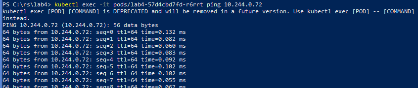

University: [ITMO University](https://itmo.ru/ru/) \
Faculty: [FICT](https://fict.itmo.ru) \
Course: [Introduction to distributed technologies](https://github.com/itmo-ict-faculty/introduction-to-distributed-technologies) \
Year: 2023/2024\
Group: K4112C\
Author: Kuznetsov Vyacheslav Sergeevich \
Lab: Lab4 \
Date of create: 14.12.2023 \
Date of finished:   \

# Лабораторная работа №4 "Сети связи в Minikube, CNI и CoreDNS"

### Цель работы
Познакомиться с CNI Calico и функцией IPAM Plugin, изучить особенности работы CNI и CoreDNS

# Ход работы

## 1. Запуск Minikube с плагином Calico:
В командной строке запускаем ноду с плагином Calico:

 

## 2. Добавление ноды:
С помощью команды `minikube node add` создаем дополнительную рабочую ноду и проверяем результат с помощью `kubectl get nodes`:

 

## 3. Проверим поды Calico:
Для этого используем команду `kubectl get pods --namespace=kube-system`:

 

## 4. Настройка сервиса:
- Установим `calicoctl`:

- Установим `label` для запущенных нод:

- создадим config-файл    для `CalicoAPIConfig`:

- используем  для запуска Calico:

- создаем  с переменными, манифест для  и .

Разворачиваем все это:

## 6. Проверим созданные поды:

## 7. Посмотрим, что все создано:

## 8. Запустим сервис на локальном компьютере:
` minikube kubectl -- port-forward service/lab4 3000:3000`

## 9. Проверим как пингуется соседняя пода:
` kubectl exec -it pods/lab4-57d4cbd7fd-r6rrt ping 10.244.0.72`

## 10. Схема организации контейеров и сервисов:

